# 简介

SEGGER SystemView 是一款针对嵌入式的可视化分析工具，分为桌面程序和嵌入式组件。

这里选用的是 SEGGER SystemView 的 V3.30 版本，移植的是对应的 FreeRTOSV9 版本嵌入式组件。

桌面程序从[Segger官网](https://www.segger.com/products/development-tools/systemview/)下载，例如 win10 x64 安装的是**SystemView_Windows_V330_x64.exe**。

嵌入式组件为当前目录源码，可通过宏 **`SYSTEMVIEW_ENABLED`** 来使能和禁止此组件，定义此宏表示使能，取消定义表示禁止。**注意**，无论使能或者禁止，都必须把此组件的头文件路径传递给编译器。

# Keil 支持

1. 源文件添加，如下图所示：
   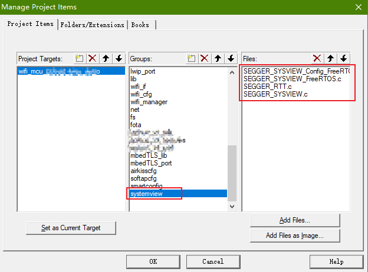
2. 头文件路径设置，如下图所示：
   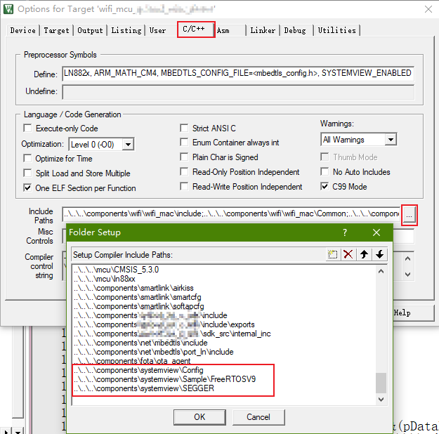
3. 工程宏设置，定义宏 `SYSTEMVIEW_ENABLED` 来使能此组件（未定义则禁止），如下图所示：
   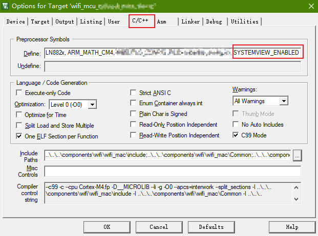
4. 编译，生成镜像文件和对应的 map 文件，例如生成的 map 文件为 `Listings/wifi_mcu_xxx.map`，搜索关键词 `_SEGGER_RTT`，找到这个全局变量定义的地址（桌面程序需要这个地址），如下图所示:
   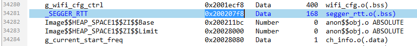

# GCC 支持

1. 默认情况下 SystemView 组件是禁止的，即顶层的 `CMakeLists.txt` 文件中的 `option(COMP_SYSTEMVIEW_SUPPORT  "A toolkit for visual analysis of any embedded system"          OFF)` ，用户**不应当**在此处修改这个值，而是在对应的用户工程中设置；
2. 用户工程如果需要使能，则修改用户工程中的 `CMakeLists.txt`，如下图所示（**截图仍禁止，只需要把第35行设置为ON则表示使能**）：
   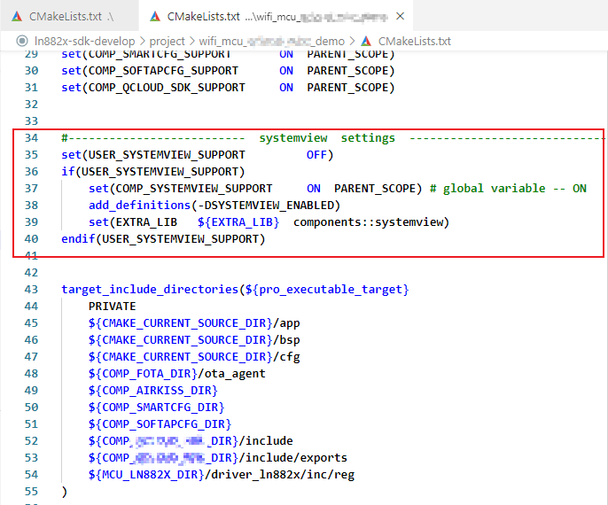
   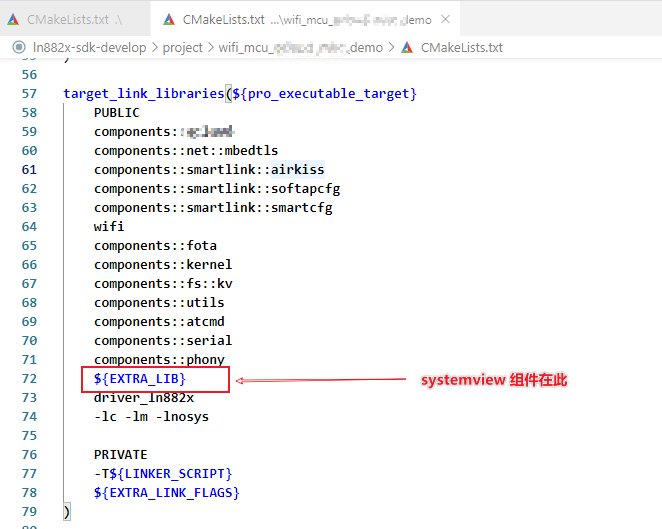
3. 顶层目录中的 `CMakeLists.txt` 也对它的头文件路径进行了设置：
   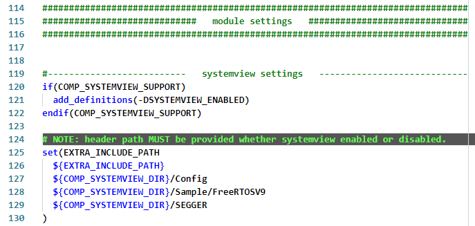
4. 编译，生成镜像文件和对应的 map 文件，例如生成的 map 文件为 `build/wifi_mcu_xxx.map`，搜索关键词 `_SEGGER_RTT`，找到这个全局变量定义的地址（桌面程序需要这个地址），如下图所示：
   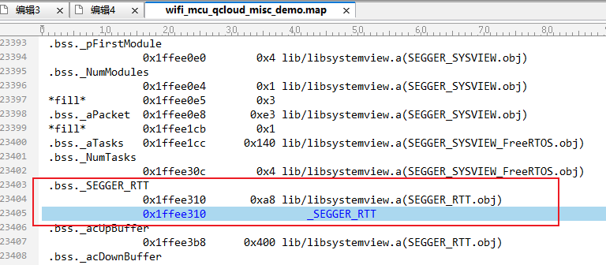

# 嵌入式代码简介

1. 初始化，在 `main()` 中硬件初始化完毕就可以调用 `SEGGER_SYSVIEW_Conf()` 初始化此组件；
2. 关于打印的几个常用API，用户可以在适当地位置调用：

```
/*********************************************************************
*
*       printf-Style functions
*/
#ifndef SEGGER_SYSVIEW_EXCLUDE_PRINTF // Define in project to avoid warnings about variable parameter list
void SEGGER_SYSVIEW_PrintfHostEx                  (const char* s, U32 Options, ...);
void SEGGER_SYSVIEW_PrintfTargetEx                (const char* s, U32 Options, ...);
void SEGGER_SYSVIEW_PrintfHost                    (const char* s, ...);
void SEGGER_SYSVIEW_PrintfTarget                  (const char* s, ...);
void SEGGER_SYSVIEW_WarnfHost                     (const char* s, ...);
void SEGGER_SYSVIEW_WarnfTarget                   (const char* s, ...);
void SEGGER_SYSVIEW_ErrorfHost                    (const char* s, ...);
void SEGGER_SYSVIEW_ErrorfTarget                  (const char* s, ...);
#endif

void SEGGER_SYSVIEW_Print                         (const char* s);
void SEGGER_SYSVIEW_Warn                          (const char* s);
void SEGGER_SYSVIEW_Error                         (const char* s);
```

# 桌面程序配置

打开桌面程序之前请先确保 Jlink 连线正确，并且开发板上电。

第一次使用最好先进行配置，如下图所示：

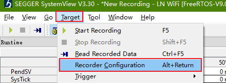

进入配置界面，先选择 **Jlink** 连接，然后配置其他参数，最重要的是地址，必须要选择前面对应的 `_SEGGER_RTT` 符号的地址。

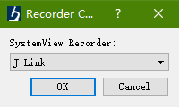

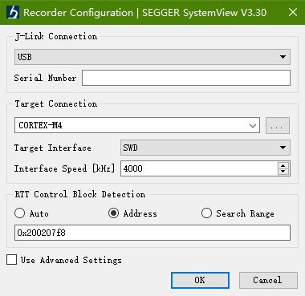
